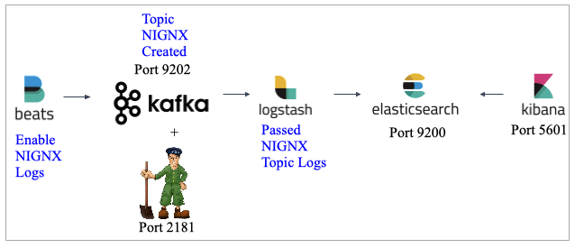

# elk-ubuntu
Terraform with Ansible provisioners to setup ELK Stack with kafka+zookeeper on AWS.

This will setup ELK+KAFKA on an single EC2 instance(ubuntu)

Prerequisites:
1) VPC
2) SUBNETS(preferably public)
3) Security Groups (with ports 5601 for kibana and port 22 for ssh).
4) Key pair for SSH 
5) IAM profile with EC2 assume role.

Overview :

Execution:

I hope you had "Terraform" and "Ansible" installed on your local or the server you trying to run this.

Terraform init

terraform plan

terraform apply --auto-approve

To delete the whole setup:

terraform destroy --auto-approve
